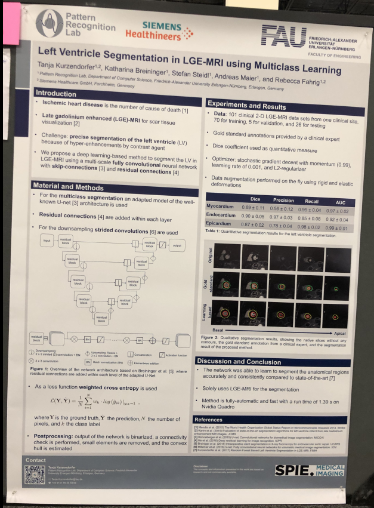
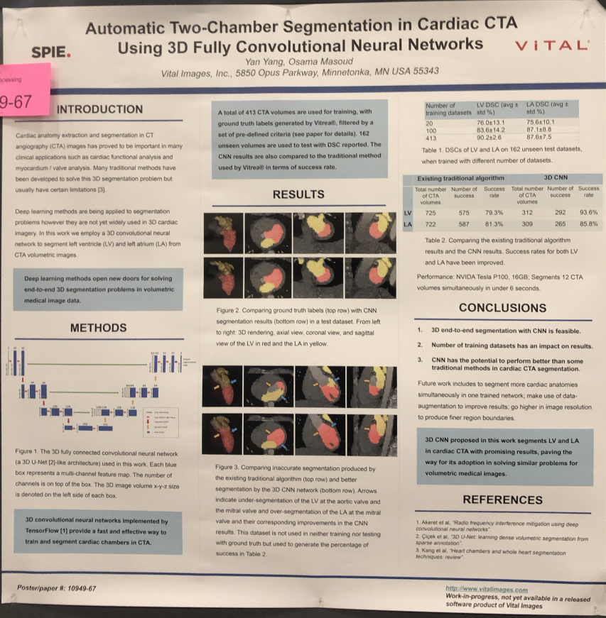

# SPIE 2019 Medical Imaging Report
> Hao Jiang			~ 02/25/2019 ~

##### Table of Contents
[CAD Breast / Mammogram related talks](#cad breast / mammogram related talks)
[Segmentation](#segmentation)  
[Keynote Speeches](#keynote speeches)
[Detector / Physics](#detector / physics)
[AI / Deep Learning / Machine Learning](#aiI / deep learning / machine learning)
[Misc.](#misc.)
[Poster](#poster)

## CAD Breast / Mammogram related talks

### **Vendor-independent soft tissue lesion detection using weakly supervised and unsupervised adversarial domain adaptation** 
- This work is an Adversarial Domain adaptation for soft tissue lesion detection
- Current soft lesion detection network limitations:
    - Due to different (prioprietary) post-processing on the raw images, current networks's performance has hardware/software - related differences.
    - Performance also relates to pixel spacing / detector type.
- Current approaches to solve this limitation:
    - Collection a lot of data / normalization (solved by) vendor differences.
    - Image normalization
        - Energy band normalization / scale energy bands to a reference value
        - Localized energy
    - Problem: energy-based normalization:
        - Takes time
        - Not necessarily the best normalization
        - Needs a lot of energineering
- Propose method: Domain adaptation:
    - Transfer learning approach
        - Test data comes from a different but related distribution than the training set
        - No labels for the target domain (unsupervised).
    - Source dataset -> Target dataset
    - P(X_s) != P(X_t)
- Domain Shift
    - Domain shift can be quantified using H-divergence
    - H is the set of all domain classifiers which maps
- Adversarial neural networks
    - Classification network
        - feature extractor
        - classifier 
    - Domain distriminator
- Adversarial disctriminative DA

    - Source CNN / Target CNN Discriminator -> domain label
    - Testing
- RevGrad
    - Reference: Ganin et al. 2016
    - RevGrad / ADDA / WDGRL - Minimize diff in feature distributions with an adverserial network
- Data for the experiments
    - positives biopsy confirmed
    - 0.2mm pixel spacing
- CNN with a VGG-like structure
    - 16 layers /adding batch normalization / no diff (DenseNet / ResNet)
    - Source images : Hologic
    - Use domain adapatation for Siemens
- RevGrad / ADDA / WDGRL (FROC)
    - statistical descend
- Balancing batches
    - Unsupervised training so no target labels
    - options: No balancing / Pseduo-labeling: Label the data using the network / weakly supervised: use the exam-level labels.
- WDGRL-PE Sensitivity
### Detecting mammographically-occult cancer in women with dense breasts using deep convolutional neural network and Radon cumulative distribution transform
- Mammographically-occult (MO) cancer
    - visually occulded, or very subtle
    - incidence rate / dense breasts high
    - sensitivity is lower
- New imaging biomarkers
    - Left-right difference is the key to identifying lesion
    - RCDT (Radon cumulative distribution transform) can amplify left-right tissue difference
    - Non-linear and invertible image transform
- Represents target image

    - Template I_0: Normal for MO / left for normal
    - Target I: cancer for MO / right for normal
    - Using image transfered by RCDT / then using CNN
- Preporcessing
    - breast segmentation / 800x500
    - Template -> Target -> RDCT Contrast enhanced
- VGG16
    - New layers 1x1x100 -> 1x1x2
- Fine-tuning setup
    - contrast enhanced RCDT
    - Train/Val/Test
    - Data augmentation x3 on training / val
    - learning rate for new layers: 10
    - stochastic gradient descent
- Classifier using handcrafted features
    - five histogram:
        - Mean
        - Standard deviation
        - Kurtosis
        - Skewness
        - Entropy within the breast
    - 16 texture features
    - non-contrast enhanced RCDT
    - same dataset split for CNN
    - feature selection method (sequentialfs in Matlab), select the best 5 features
- Results:
    - combined > CNN_CC > CNN_MLO  
    - Gradient guided class activation map
        - Selvaraju (2017)
        - CNNs indicate area of rapid intensity change (from low -> high)
    - Handcrafted features
        - Entropy was strongest
- Summary
    - CNNs learn characters of MO
### Deep learning for identifying breast cancer malignancy and false recalls: a robustness study on training strategy 
- Transfer learning
    - Layer freezing
    - Incremental training
    - Reference AboutLab 2018s
- Study:
    - 8 different model structures
    - 5 datasets
- Datasets:
    - ImageNet
    - ChestX-ray8
    - DDSM
    - Breast Density
- Malignant vs. recalled benigh
- AlexNet / ResNet-50
- 3 Class task
### Evaluating deep learning techniques for dynamic contrast-enhanced MRI in the diagnosis of breast cancer
- Transfer learnining
    - feature extraction
    - fine-tuning
- MIP images yield superior results
- VGG19 (ImageNet pretrained weights)
- Comparison:
    - pre-contrast
    - first post-contrast
    - second post-contrast
- Reference: Natalia 2017
- Radiomics-based CADx
### Deep learning framework for digital breast tomosynthesis reconstruction 

### Multiview mammographic mass detection based on a single shot detection system

### Visual evidence for interpreting diagnostic decision of deep neural network in computer-aided diagnosis
- CAM (Class activation method)

- Visual Interpretation

- Training procedure:

- Diagnostic loss
- Visual interpretation guide losses
  - Interpretation loss
  - consistency loss
  - extra supervision loss
- Experimental conditions
  - DDSM
  - FFDM (clinical digital mammogram database)

- Effect of additional supervision loss
  - With / WO extra supervision loss

- Comparison with conventional method
- Assessment of visual evidence
  - AORTF on clinical FFDM DB

- Conclusions
  - New deep neural network
    - To provide visual evidence of the diagnostic decision
    - to show the import areas according to the margin and shape of masses
  - Effectiveness of the proposed method was verified on the mammogram 
- Grad-CAM

## Segmentation
### Automatic multi-modality segmentation of gross tumor volume for head and neck cancer radiotherapy using 3D U-Net
- Introduction

    - GTV delineation
        - Guide radiation planning
        - Proper plan and dose optimization
    - Manual delineation
        - Consuming labor
    - PET / CT

- Multi-modality

- 3D U-Net

    - Denseconnection
    - Reuse of feature
    - Number grows linearly
    - Dense block with all connection

- 3D convolution / build from dense blocks, transition down and transition up
    - composed by encoder and decoder
    - number of feature size

- Results
    - Dice Similarity Coefficient

- Conclusion:
    - Auto segmentation
    - Multi-modality
    - Public dataset
    - 3D Conv Net
    - Dese connection
    - Better result with less trainable parameters
    - Source code will be online

### Deep-learning method for tumor segmentation in breast DCE-MRI
- Algorithm based on watershed transformation
- Method based on fuzzy C0means
- 3c U-net
- 2c U-nets
- Ronneberger
- Second post-contrast sequence scan
- Slice thickness 1.3mm
- Customized UNet Archetecture
- 3D Mask volume
- Training
    - Initial learning rate of 1e-3
    - Early stopping
    - Batch size 32 for 2D and 4 for 3D
- Post processing with sub-volume and combine
- Less false positives generated by 3D Unet
- Both 2D and 3D are comparable

### Large-scale evaluation of multi-resolution V-Net for organ segmentation in image guided radiation therapy
- Previous methods:
  - Deformable shape models
  - Atlas-based segmentation
- Popular methods Nowadays
  - U-Net
  - V-Net (Milletari 2016) Extenstion to U-Net
- Input CT -> Down-sample -> Coase-level segmentation
- Back-sample <- Fine-level segmentation 
  - Down-sample /  Mask Dilation
- Model compression & memory consumption
  - V-net is too large for production purpose
    - Reduce kernel size (5x5x5 -> 3x3x3) (250MB -> 57 MB)
    - Model size of a 3D conv / output_channels x input_channels x k x k x k
  - Large model size of V-net comes
  - Use bottle-neck structure to replace conv layers with large channle size
  - -> 8.8 MB
- gpu memory consumptioni of V-Net is high if the input volume is large, e.g. Liver.
- Down-sample outside network / inside network

### Multi-class abdominal organ segmentation with improved V-Nets 

### Unsupervised segmentation of micro-CT images based on a hybrid of variational inference and adversarial learning

## Image Guidance
### Automatic marker-free target positioning and tracking for image-guided radiotherapy and interventions

## Keynote Speeches
### AI research and applications in radiology: experience in China 
- Therapeutical evaluation
- Disease detection
- Diagnosis

### The U-net and its impact to medical imaging (by Deepmind)

- The U-Net and its impact toe medical imaging
- The future of U-Nets, GANS etc.
- MICCAI most cited paper
- Segmentation for therapy planning w UCL Hospital
- Triage Recommendaition for eye diseases
- Probabilistic U-Net for segmentation of ambiguous images
- For head and Neck cancer radiotherapy planning
- segmentation -> Dosimetric optimization -> Therapy
- take 4 hours to segment 1 scan
- Goals:
    - Segmentation of 21 "organs at risk"
    - Headd & neck.
    - 4 hours to < 1hour
- Evalution of model and human performance
    - 3D U-net
- Performance metric 
- Surface DSC
- acceptable deviation 
- Overlapping surface area / total surface area

github.com/deepmind/surface-distance
in Arxiv paper

- clinically applicable deep leaerning for diagnosis of eye OCT
- OCT scan
- Like ultrasound but light
- two stage architecture

segmentation network ensembel _> tissure map hypotheses -> classification
- 3D densenet for classification

- Use better OCT device
- No diagnosis labled needed for images from new device, no need to retrain
- U-net with device adaptation branches

two-stage architecture:
     clinically interpretable
     classification acquireds universal knowledge of human anatomy
     Nature medicine article

 - Probablity U-Net
 - U-Net + conditional VAE
 - Hypotheses can be propagated into next diagnostic pipeline steps
 - best-fit could be picked by clinician and adjusted if necessary
 - probabilistic segmentation
 - hypotheses could inform actions to resolve ambiguities

- segmentation variants embedded in latent space

Image -> Prior net -> latent space -> comb. 
Posterior Net

- pixelwise uncertainty 'Bayesian SegNet' Kendall 2015
- image-image translation bicycleGAN

- Dropbout U-Net
- Image2Image VAE
- Lung cancer segmentation
- M-Heads
- Generalized energy distance statistics

- Summary:
 A combination of the u-net with a condition VAE prodcuese the full distribution of plausible segmentation maps.
 compared to baselines:
 unlinked number of samples
 efficient sample
 no need to adjust model to number of modes udring rainging 

 rep online in github

 - Ultimate performance metric is patient benefit
 - problem-specific performance metric for realisti sestimate of the realwordl performance
 - representative test sets with highest possible gold-standard labels.
 - two-stage architecture provides iterpretability and device independence

- replace deterministi cmodel to probablistic model
- monte-carlo dropout

### Changlenge of next generation healthcare
- By Nvidia
- Holger Roth
- TOUCH-AI use cases
- Research trends in medical imageing:
    - Uncertainty estimation: Explaninable AI / Active learning
    - Network Innovations: Hyperparameter tuning / AutoML
    - Heterogeneous data: Transfer learning / Domain adaptation / Meta-learning / Federated learning
    - Weakly supervised: bounding boxes / Reports

### Has deep learning basically solved CAD?
- DL for detection / segmentation

## Detector / Physics
### Comparison of CMOS and amorphous silicon detectors: determining the correct selection criteria to optimize system performance for typical imaging tasks 

### Patient-specific noise power spectrum measurement via generative adversarial networks 
- Deep learning bootstrapping
- Subject-specific generator
    - white noise as input
    - correlated
- scaled conjugate gradient descent

### Dose-independent near-ideal DQE of a 75 μm pixel GaAs photon-counting spectral detector for breast imaging 
- Dectris
- photon counting for breast imaing 
- GaAs for PCD
- low-dose high resolution imaiging
    - zero electronic noise
    - direct x-ray conversion w/ minimal iner-pixel blurring
- low-dose high contrast imaging
    - same weighting for all energy photons
- minimal artifacts
    - high dynamic range
- spatial pattern noise (fixed/stable)
- fluroscense low 10kev
- 8 x 4
- dead time < 1us

### Novel hybrid organic-inorganic perovskite detector designs based on multilayered device architectures: simulation and design 
- Perovskite
- Flexible substrate
- Multilayered design / folded design

### Human-compatible multi-contrast mammographic prototype system 
- grating-based multi-contrast imaging
- Talbot-Lau interferometer

### Dual energy imaging with a dual-layer flat panel detector 
- Varax
- DE CBCT for adaptive planning
- Real time fluro for motion tracking
- Soft tissue motion tracking
    - Motion management in RT
        - Breath holding
        - Free breating methods: ITV, gating, tracking, surface imaging etc.
    - DE fluro for non0invasive motion tracking uding double shot
    - DE fluro using a dual layer FPD using single shot mthod
- ART
    - DE CBCT
- Double-shot method
    - Motion artifacts
- Single shot method
    - worse energy separation
- 150 um pixel
- 7.5 fps
- 7 gain setting for top/bottom layer
- Dual layer FPD geometry calibration
- Soft tissue motion tracking
- Virtual monoenergetic images
- top: 200um bottom 550um

### Performance evaluation of a Se/CMOS prototype x-ray detector with the Apodized Aperture Pixel (AAP) design 
- AAP design
- Noise aliasing / high frequency drop in DQE
- as much as 60%
- Element size 5-25um
- 1cm^2 area

### Towards large-area photon-counting detectors for spectral x-ray imaging 
- 8 x 8 cm
- 1mm thick CdTe
- tilted
- each module 2x2 cm 16 module totoal

### Novel direct conversion imaging detector without selenium or semiconductor conversion layer 
- Just dielectric layer to generate image

### Spectrum optimization in photon counting detector based iodine K-edge CT imaging 
- Iodine k-edge - water
- polychromatic radiation
- K-edge filter of the beam
- Iodine k-edge ct imaing with an iodine filter
- Cramer-Rao Lower Bound
- Fisher information matrix
- Better energy bin separation
- Three material decomposition

### Image reconstruction from fully-truncated and sparsely-sampled line integrals using iCT-Net 
- Maximum A Poterior (MAP)
- piece-wise constant

### Multi-x-ray source array for stationary tomosynthesisor multi-cone angle cone beam CT 
- John Boone group
- Flat panel made cbct practical
- MXA make cbct perform better

### Multi-energy CT w/ Trilple X-ray Beams
- image two or more contrast agents (energy resolving and multiple energy bins)
- Twin-beam on single source CT to enable DECT
- Au Sn Al filter
- Dual source tri-beam

### Indirect photon-counting x-ray imaging CMOS photon detector (CPD)
- Sony
- CMOS photon detector
- Ultra high sensitivity CMOS imager "CMOS photon detector"
- indirect x-ray photon-counting
- CIS
- pixel photo-diodes are expanded keeping their comletee transfer and minimum pixel readout noise
- non-electron multiplying
- 160fps
- count rate limitation ? capacitor ? counter? 
- 8x8 pixels / 6.2 e- in each light spot
- Photon counting efficiency ?
- 30kv w/o filter
- 100k cps ? good w/ CsI 

### Increased count-rate performance and dose efficiency for siliocon photon-counting detectors for full-field CT using asic w/ adjustable shaping time
- edge-on silicon strip detectors
- GE lightspeed VCT gantry
- Shaping time
    - short pulses: less pileup, high noise
    - Long pulses: more pileup, low noise
    - Adapt pusle length according to x-ray flux to achieve minimum noise threshold without compromising the count-rate perfrormance
- Pulse shape estimation
- Transition from double to single counting

### Experimental study of neural network material decomposition to account for pulse-pileup effects in photon-counting spectral CT

## AI / Deep Learning / Machine Learning
### Identifying disease-free chest x-ray images with deep transfer learning 
- datasets: 
    - NIH chestX0ray14
    - MIMIC-CXR
- X. Wang CVPR 2017
- P.  stanford
- Normal /abnormal classification
    - Minimie false positives
- Framework
    - Transfer learning
    - Inception-ResNet-v2
    - Dilated ResNet Block
    - Tesla P100 (16G)
- Remove 50% normal cases

### Analysis of deep convolutional features for detection of lung nodules in computed tomography 
- Feature extraction
- InceptionV4 / Inception-ResNet
- Feature embedding
- UMAP of radiomic features
- RRHO Maps / True positives

### Low-dose CT count-domain denoising via convolutional neural network with filter loss 
- filter-loss 
- count-domain
- Simple U-Net
- filter-loss / more relevant to the reconstruction
- MAE loss

### Artifact-driven sampling schemes for robust female pelvis CBCT segmentation using deep learning
- Varian
- Adaptive Radiotherapy (ART)
- Delivery of the dose over several factions
- Change in bladder volume
- Automation required
- CBCT artefact
- lower dose / scatter / Respiratory motion (longer scan times)
- Leading to Noise / lower contrast / streaking artefacts
- Air enclosed in bowel
- Goal: design a sampling scheme 
- class imbalance / selcective sampling of misclassifed samples / sampling of difficult image regions
- Bladder / Rectum / Uterus
- Data: CBCT: 21 patients, 351 scans, retro contoured
- CT: 92 patients.
- 2D U-Net: 
    - 4  resolution levels / Receptive field: 92x92
    - 4 output channels
- Training on 188^2 patches of axial slices resampled to 2.5mm^3 isotropic resolution
- Idea of Curriculum Learning
    - start with easy task )training on artifact free patches
    - increase difficulty of task (sample patches with artifacts)
    - Integration of domain knowledge
- decrease learning rate
- Indirect artiface estimation
    - artifacts are mainly caused by respiratory motion during acquisition with air within the bowel
    - compute body mask -> threshold at 300 HU -> exclude air in rectum -> compute volume per slice
    - Use volume of air / slice
- Estimated air distribution
- GDS descrease 1-4, better with curriculum
- Slice-wise dice scores
- Progress during curriculum training
    - Overall best DNN is saved within 30k iterations
    - trade-off between organs
    - no further imporvement when traiong only on slices with air / artifacts
- Performance varies strongly on slices w/ vs. wo/ artifacts
- Integration of domain knowledge may be helpful
- curriculum learning more promising than fixed sampling ratio ofr improving on regions w/ artifacts while maintaining performance on those wo/
- limitations hand-crafted scheme, noise
- visibility of organ contrours on slices affacted by severe artifacts
- future work: direct estimation and sampling of artifacts, 3D training

### Combining deep learning methods and human knowledge to identify abnormalities in computed tomography (CT) reports 
- Using text-based CT reports -> Developing a text-classification model -> Active learning
- Goal: develop a model identifies abnormalities within the CR reports and requires a significant reduced set of leabeled report
- clinical history / fidndings / impression / signature
- Inclusion criteria : ct of the chest abdomen and pelvis / Findings and impressions sections
- Data cleaning: eleminate test befrore findings / signature
- create binary leabels for every organ
- Develope a classification model -> Training the model -> select report w/ highest uncertainty reduction -> clinician create label for the selected report -> Add new dat a to rtraining set
- Label embedding Attentive Model (LEAM)
    - Report X: sequence of words
    - label y 1 abnormal , 0=normal
    - f0 word embedding: maps words to vectors
    - calculate attention score b)
    - f1 average of word embeddings weighted by attention score: Z = f0(x)*B
    - f2 multilayer perceptron predictiong y
- selection criteria : 
    - criteria: minimize the uncertainty of the model
    - measured uncertain through the covariance of the parameters
- Active learning requires less iterations than random sampling to achieve a coomparable performance
    - random sampling
    - simulated active learning
    - active learning

### Ensemble 3D residual network (E3D-ResNet) for reduction of false-positive polyp detections in CT colonography 
- E3D-ResNet  AUC value at 0.984

### Two-level training of a 3D U-Net for accurate segmentation of the intra-cochlear anatomy in head CT with limited ground truth training data 
- Condition GAN to add restraint / robutness of the model

## Misc.

## Posters

